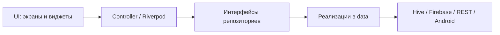
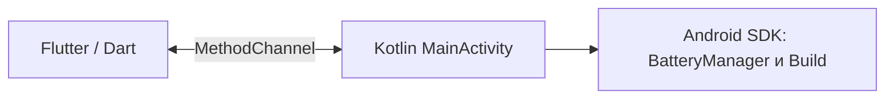

# FinTracker

FinTracker — персональный финансовый менеджер на Flutter. Приложение помогает вести счета и операции, планировать бюджет и накопления, анализировать расходы. Основной сценарий рассчитан на Android: данные доступны локально после входа и синхронизируются с Firebase при наличии сети.

## Возможности

- **Операции:** доходы, расходы и переводы между счетами; категории, поиск, редактирование и удаление.
- **Планирование:** месячные бюджеты по категориям, цели накоплений, долги и частичные погашения, калькулятор накоплений.
- **Обзор:** общий баланс, счета, графики расходов с датой и суммой при касании, аналитика по неделе, месяцу и году, отчёты с экспортом CSV, Excel и PDF.
- **Валюты:** курсы Национального банка Казахстана через Frankfurter API и конвертер в тенге.
- **Место и чек:** геолокация операции и карта OpenStreetMap; фотография чека из камеры или галереи.
- **Локальная и облачная работа:** Hive хранит данные на устройстве в области пользователя; Firestore синхронизирует финансовые данные, Firebase Storage — изображения чеков.
- **Уведомления:** FCM и локальная история; на Android планируются напоминания за день до срока незакрытого долга или цели. Автоматической серверной отправки FCM в проекте нет.
- **Устройство:** встряхивание открывает форму новой операции (Shake to Add); собственный Kotlin MethodChannel показывает сведения об Android устройстве и батарее.
- **Оформление:** Material 3, светлая/тёмная тема и цветовые варианты.

## Экраны и навигация

`GoRouter` направляет неавторизованного пользователя на вход или регистрацию. После входа главная оболочка содержит вкладки **Главная**, **Операции**, **Аналитика** и **Ещё**, а центральная кнопка открывает создание операции. Из «Ещё» доступны счета, бюджеты, цели, долги, отчёты, валюты, калькулятор, карта, аккаунт, настройки и диагностика. Карточки операций и долгов открывают детали и действия редактирования.

Основные маршруты определены в [`app_router.dart`](lib/core/router/app_router.dart) и [`app_routes.dart`](lib/core/router/app_routes.dart); вкладки — в [`main_shell.dart`](lib/presentation/shell/main_shell.dart).

## Стек

| Область | Технологии |
|---|---|
| UI и навигация | Flutter 3.47.6, Dart 3.13.5, Material 3, GoRouter |
| Состояние | Provider и ChangeNotifier; Riverpod для экрана валют |
| Данные | Hive, SharedPreferences, Dio, Frankfurter REST API |
| Firebase | Core, Auth, Cloud Firestore, Storage, Messaging, Crashlytics; Google Sign-In |
| Устройство | flutter_map и OpenStreetMap, geolocator, image_picker, path_provider, sensors_plus, Kotlin MethodChannel |
| Отчёты и уведомления | pdf, excel, printing, share_plus, flutter_local_notifications, timezone |

Полный перечень версий находится в [`pubspec.yaml`](pubspec.yaml) и [`pubspec.lock`](pubspec.lock).

## Архитектура

Код разделён на `lib/presentation` (экраны, виджеты, контроллеры), `lib/domain` (сущности и интерфейсы репозиториев), `lib/data` (Hive, Firebase, REST и сервисы) и `lib/core` (роутер и темы). Зависимости для основных функций создаются в [`main.dart`](lib/main.dart) и передаются через Provider; валютный экран использует Riverpod.





Подробности и схема синхронизации — в [`docs/architecture.md`](docs/architecture.md).

## Состояние и хранение

Provider обслуживает основное приложение: финансовые данные, авторизацию, синхронизацию, темы и уведомления. Riverpod обслуживает полный сценарий валют: загрузку, состояния ожидания/ошибки, обновление и конвертацию. Два подхода сосуществуют как отдельные потоки управления состоянием для демонстрации требований курса; основное приложение не переписывалось.

Hive хранит финансовые записи локально и разделяет их по Firebase UID. Firestore хранит облачную копию в `users/{uid}/...`. Для чека `receiptPath` означает **локальный путь/кеш**, а `receiptStoragePath` — **путь объекта Firebase Storage** вида `users/{uid}/receipts/{transactionId}/receipt-<version>.<ext>`. Новый Firestore документ записывает только облачный путь; чтение старого документа без него поддерживается. При недоступности Storage операция остаётся локально и может синхронизироваться отдельно от чека.

У нового пользователя счета, операции, бюджеты, цели и долги пусты; первый счёт он создаёт сам. Встроенные категории остаются доступными как справочник. Существующие локальные и облачные данные при обновлении не удаляются.

`SyncController` откладывает отправку локальных изменений на 1,2 секунды, отслеживает изменения облачного метадокумента и хранит признак ожидающей отправки. Это синхронизация снимков коллекций, **без слияния отдельных полей при одновременном редактировании на двух устройствах**. Детали — в [`docs/architecture.md`](docs/architecture.md).

## Firebase, карта и Android

Firebase Auth поддерживает email/пароль и Google Sign-In. Firestore синхронизирует счета, операции, бюджеты, цели и долги; Storage хранит чеки; Messaging принимает push и регистрирует токен устройства; Crashlytics получает ошибки на Android. Автоматический сбор Crashlytics выключен в debug и включён в profile/release. Исходник правил Storage — [`storage.rules`](storage.rules); фактические правила Firestore в этом репозитории не представлены.

Карта реализована через `flutter_map` и плитки **OpenStreetMap** с указанием источника; `geolocator` запрашивает координаты и разрешение. Если формулировка задания требует именно Google Maps SDK, это технологическое отличие: картографическая функция есть, но платёжный Google Maps API не используется.

Shake to Add читает `userAccelerometer` через `sensors_plus`. Два сильных импульса за 650 мс открывают форму операции; после срабатывания действует пауза 1,8 секунды. Действие можно отключить в настройках. Нативная диагностика Android использует канал `com.example.fin_tracker/native_device` с методами `getBatteryInfo` и `getDeviceInfo`.

## Запуск локально

1. Установить Flutter **3.47.6**, Android SDK и JDK 21.
2. Добавить локальный `android/app/google-services.json` для Firebase проекта, соответствующего `com.example.fin_tracker`. Файл игнорируется Git. Для работы Auth, Firestore и Storage нужны настроенные службы и права доступа в Firebase Console.
3. В корне проекта выполнить:

```sh
flutter pub get
flutter run
```

Web сборка проверяется командой `flutter build web`, но локальные уведомления, датчик и Kotlin диагностика реализованы для поддерживаемых мобильных платформ; Web Push в проекте не настроен.

## Тесты, CI и release

В проекте **85 автоматических тестов**. Последний локальный прогон с LCOV дал **54,60%**; порог проекта — **40%**. Покрытие считается по файлам, включённым Flutter в `coverage/lcov.info`.

```sh
dart format --output=none --set-exit-if-changed lib test tool
flutter analyze
flutter test --coverage
dart run tool/check_coverage.dart
```

GitHub Actions в [репозитории](https://github.com/dunanhub/FinTracker) запускает format, analyze, тесты, проверку покрытия, debug APK и Web build на push/PR в `main`. Автоматического production deploy нет. Сценарии тестирования — в [`docs/testing.md`](docs/testing.md), оценка производительности — в [`docs/performance.md`](docs/performance.md).

Release собирается командами `flutter build apk --release` и `flutter build appbundle --release` с локальным ключом. Настройка и проверка подписи описаны в [`docs/release.md`](docs/release.md). Краткая шпаргалка для демонстрации — [`docs/defense.md`](docs/defense.md); таблица требований — [`docs/requirements.md`](docs/requirements.md).

## Безопасность

`android/key.properties`, `*.jks`, `*.keystore`, `android/app/google-services.json` и `.env` исключены из Git через [`.gitignore`](.gitignore). Release ключ и пароли не входят в исходники; CI получает клиентский Firebase JSON из GitHub Secret. Правила доступа Storage ограничивают путь пользователя по UID. Развёрнутые правила Firestore нужно проверять отдельно в Firebase Console.
