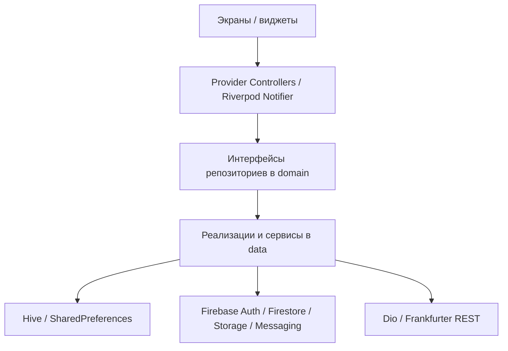
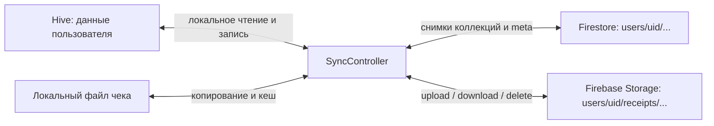
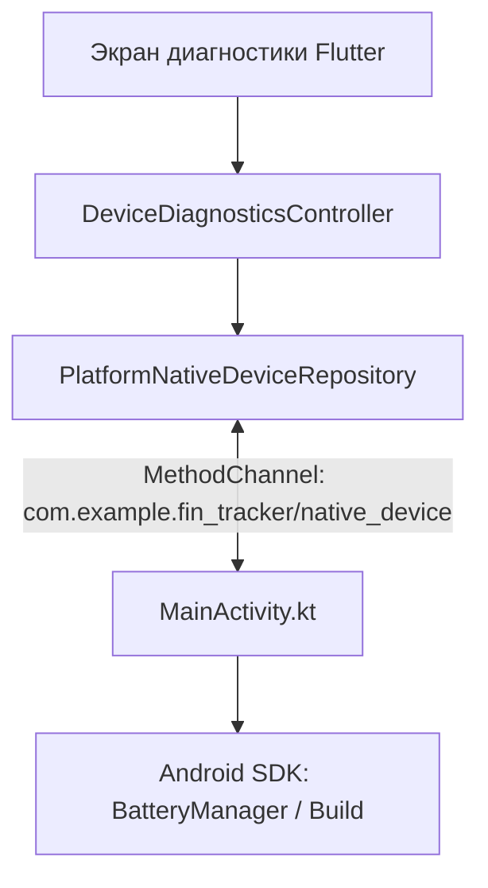

# Архитектура FinTracker

## Слои и поток данных

| Слой | Ответственность | Примеры |
|---|---|---|
| `lib/presentation` | Экраны, взаимодействие, состояние, навигация | `FinanceController`, `SyncController`, `CurrencyRatesNotifier`, `MainShell` |
| `lib/domain` | Финансовые сущности, контракты репозиториев, правила напоминаний | `FinanceTransaction`, `FinanceRepository`, `ReminderPolicy` |
| `lib/data` | Чтение и запись данных, Firebase, REST, сервисы устройства | `HiveFinanceRepository`, `FirebaseSyncRepository`, `FrankfurterCurrencyRepository` |
| `lib/core` | Общие настройки интерфейса | `AppRouter`, `AppTheme`, `ThemeController` |

`main.dart` инициализирует Firebase и Hive, создаёт репозитории и контроллеры, затем передаёт их в `FinTrackerApp`. `MultiProvider` обслуживает основную часть приложения, `ProviderScope` — валютный экран Riverpod. `GoRouter` проверяет состояние `AuthController` и переключает маршруты входа и главной оболочки.

## Данные и синхронизация

Финансовые данные сначала сохраняются через контроллеры в локальные Hive репозитории. После входа `SyncController` переключает Hive на область UID, выбирает локальный или облачный снимок и при необходимости переносит старые локальные данные. Локальные изменения отмечаются как ожидающие отправки в SharedPreferences и отправляются после задержки 1,2 секунды или ручной команды. При отсутствии сети локальная копия остаётся доступной; состояние синхронизации сообщает об ошибке.

Firestore хранит `accounts`, `transactions`, `budgets`, `goals`, `debts` под `users/{uid}` и `users/{uid}/_sync/meta` с отметкой устройства. Слушатель meta игнорирует собственную запись, а изменение другого устройства запускает загрузку. Если есть ожидающие локальные изменения, контроллер сначала пытается их отправить. Иначе облачный снимок заменяет локальные списки. Репозиторий при upload заменяет документы коллекций и удаляет отсутствующие. **Слияния изменений отдельных полей и гарантии бесконфликтного одновременного редактирования нет**; это ограничение следует учитывать при демонстрации двух устройств.

Изображение чека сохраняется `ReceiptImageService` в каталоге приложения. `FinanceTransaction.receiptPath` — только локальный путь; `receiptStoragePath` — путь объекта Storage. Новые записи Firestore не получают локальный путь. При загрузке с другого устройства чек скачивается в пользовательский локальный кеш. Если Storage временно недоступен, финансовая операция не удаляется; загрузку чека можно повторить. Старые записи без `receiptStoragePath` читаются. Удаление устаревших облачных объектов помещается в очередь для повторной попытки.

История уведомлений хранится отдельно по UID в Hive. `ReminderPolicy` выбирает непогашенные долги и незавершённые цели и планирует Android уведомление за день до срока в 09:00 через `flutter_local_notifications`. FCM сообщения, полученные при открытом приложении или открывшие его по нажатию, добавляются в историю; автоматической серверной рассылки нет.

## Нативный канал

Flutter вызывает `getBatteryInfo` и `getDeviceInfo`. Kotlin возвращает заряд/источник питания и производитель/модель/версию Android. На Web и не-Android платформах репозиторий сообщает, что диагностика недоступна.

## Управление состоянием и ошибки

Provider/ChangeNotifier используется для основных финансовых сценариев, тем, авторизации, синхронизации и уведомлений. Riverpod `AsyncNotifier` валют обрабатывает загрузку, данные, ошибку и повторный запрос; этот отдельный поток показывает второй подход без перестройки приложения. Репозитории внедряются через конструкторы, что позволяет подменять их в тестах.

Ошибки REST переводятся в понятные состояния экрана, ошибки Storage не уничтожают операцию, а ошибки Crashlytics не блокируют запуск. Глобальные Flutter/Dart ошибки подключаются после `Firebase.initializeApp`; сбор Crashlytics на Android выключен в debug и включён в profile/release.
